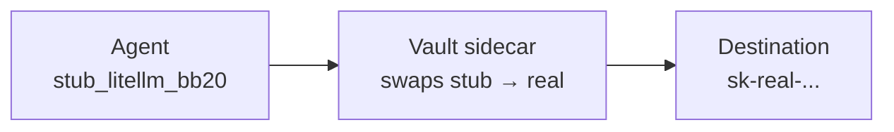

Self-hosted Kubernetes infrastructure for Claude Code, Codex, and any coding agent — **without ever giving them your real API keys**. A vault proxy swaps stub credentials for real keys at the wire level, so agents never hold the real values.


```bash
$ lap claude-code-cli1
```

## How it works



The agent process only ever sees stub credentials. Real values exist in the vault sidecar's memory and on the wire — nowhere else.

## Get started

<CardGroup cols={3}>
  <Card title="Install" icon="bolt" href="/installation">
    Run locally on kind, or deploy to AWS EKS.
  </Card>
  <Card title="Run Claude Code" icon="robot" href="/quickstart/claude-code">
    Open your first sandbox from the terminal.
  </Card>
  <Card title="Learn the vault" icon="shield-halved" href="/learn/vault-proxy">
    How agents stay isolated from real credentials.
  </Card>
</CardGroup>
